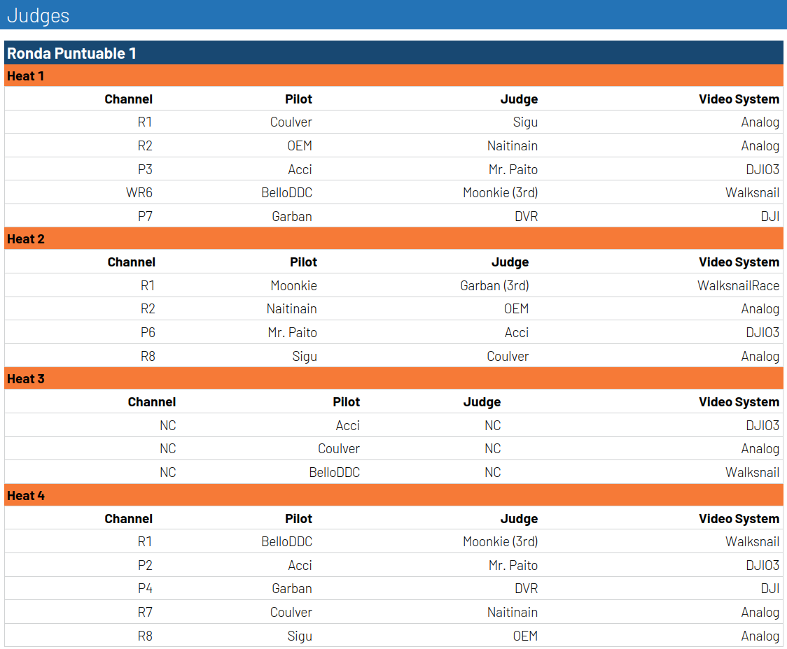

# La Lligueta Judges

In the Catalan drone racing league [La Lligueta](https://lalligueta.com/) we have judges for every heat. What that means is that a second pilot is spectating to make sure that all the obstacles are completed successfully. This assignation depends on the video system as we support multiple of them, it's for this that we have created this plugin.

## Features
- Define the video system of each pilot when creating the pilots
- Visualize the channel (more on that [here](doc/Channels%20Adjusted.md)), pilot, judge and video system in the Format tab

## Judges Algorithm
Assign a judge to every pilot on every heat with the following algorithm:
- From all the pilots in the **race class** remove those that participate in the heat (pilots and other judges)
- Try to assign a judge with the same video system to all the heat. Randomly select a judge between all the pilots with the same system
- If there are no pilots remaining show DVR
- If there are pilots remaining randomly select a pilot to spectate in 3d person, if we run out of pilots show DVR

> [!IMPORTANT]
> Given a race class, only the pilots in it are elegible judges. If you have pilots defined in the databes that do not participate in that class they will not be elegible judges.
> 

> [!NOTE]
> We know that for DJI it depends on the googles you have who you can or can not see. In the future we might add that condition as well. For now it has to be someone with the same exact system as you to be a 1st person judge.

## Examples
First define the video system under Format -> Pilot

Then define your class and it's heats normaly.

Finaly, go to Format -> Judges and you will see the assignation of the judges.

> [!TIP]
> Go to the [channels adjusted](doc/Channels%20Adjusted.md) document to understand what the options are in the *Channel* column

